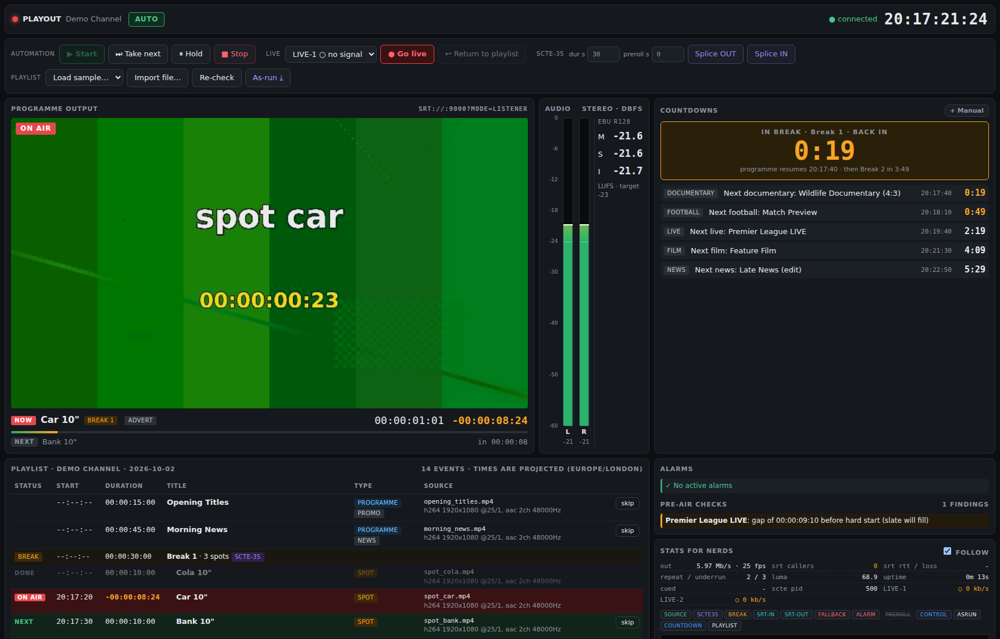

# Playout POC

A basic broadcast playout system: imports a playlist, plays files and live SRT feeds to a
1080p25 SRT programme output, handles ad breaks with SCTE-35, and gives the operator a web UI
with preview, audio meters, countdowns and a "stats for nerds" event log.

No authentication. This is an MVP / proof of concept.



## Features

| Area | What it does |
|------|--------------|
| **Playlist import** | JSON or CSV ([format](docs/playlist-format.md)). Programmes, live items, breaks with spots, follow/hard starts, in points. Load a sample or upload a file from the UI. |
| **Pre-recorded + live** | Files are cued (prerolled) 3s ahead for clean cuts. Live items take an SRT feed. Any input format/resolution is normalised to 1080p25 / 48 kHz stereo. |
| **Breaks** | A break groups spots. On break start: SCTE-35 `splice_insert` OUT with the break duration. On break end: splice IN. Skipped spots are handled. |
| **SCTE-35** | Inserted on PID 500 of the output TS (with null heartbeats). Manual **Splice OUT** (duration + preroll) and **Splice IN** buttons. |
| **Countdowns** | Automatic: next break, next live, next item of every category (news, football, film…), all from the projected timeline. Manual: from a button, "in mm:ss" or "at HH:MM", optionally with an action at zero (**go live**, take next, SCTE out). |
| **UI** | Playlist with live projected times, programme preview, stereo peak/RMS meters with peak hold, EBU R128 loudness (M/S/I), on-air/next with timers, alarms, pre-air checks. |
| **As-run log** | What actually went to air, with frame-accurate times and status (complete / truncated / interrupted / error / fallback). Daily CSV in `data/asrun/`, downloadable from the UI. |
| **Fallback slate** | If a live feed has no signal or drops, or a file fails, a slate goes on air automatically. When the signal returns, the live feed comes back. The slate also fills gaps before hard starts. |
| **Manual control** | Start (from any item) / Stop, Take next, Hold (stop auto-advance), Skip/unskip, Go live (live override) / Return to playlist. |
| **Pre-air checks** | Missing/unreadable media, media shorter than planned, no audio, gaps and overlaps around hard starts. |
| **Loudness & alarms** | Alarms for black, silence, loudness over -20 LUFS short-term, fallback on air and failed items. |
| **Stats for nerds** | Live numbers (output bitrate/fps, SRT callers/RTT/loss, repeated frames, audio underruns, input signal and bitrate). Filterable event log: source changes, SCTE markers, breaks, SRT connects, alarms, preroll, operator actions. |

## Quick start (Docker)

```bash
docker compose up --build
# open http://localhost:8080
```

Sample media is generated into `./media` on first start (takes about a minute).
I have not been able to test the Docker image build in my environment; the native setup below has been tested.

## Quick start (native, Ubuntu 24.04)

```bash
sudo apt install python3-venv python3-gst-1.0 gir1.2-gst-plugins-bad-1.0 gstreamer1.0-tools \
  gstreamer1.0-plugins-{base,good,bad,ugly} gstreamer1.0-libav ffmpeg fonts-dejavu-core
python3 -m venv --system-site-packages .venv
.venv/bin/pip install -r backend/requirements.txt
scripts/make_sample_media.sh                 # test clips -> ./media
(cd ui && npm install && npm run build)      # UI -> ui/dist (served by the backend)
cd backend && ../.venv/bin/python -m playout # http://localhost:8080
```

For UI development, run `npm run dev` in `ui/` (http://localhost:5173). It proxies `/api` and `/ws` to the backend.

### Demo in 30 seconds

1. Open http://localhost:8080 → **Playlist → Load sample… → playlist.json**, then **▶ Start**.
2. Watch the output in VLC (below). The sample has three breaks (with SCTE-35), a 4:3 programme
   (pillarboxed), and a live football item with a hard start 2m30s after loading.
3. Feed the live item: `scripts/send_test_srt.sh 9002 FOOTBALL`. Without it, the fallback slate covers the live slot.
4. Try **+ Manual → Breaking news** (a countdown that goes live on LIVE-1 at zero) while sending
   `scripts/send_test_srt.sh 9001 BREAKING`. Then **↩ Return to playlist**.

## Watching the output in VLC

The programme output is an **SRT listener on UDP port 9000** (MPEG-TS: H.264 High 1080p25
~6 Mb/s, AAC-LC stereo 192 kb/s, SCTE-35 on PID 500). Players connect as SRT callers:

* **VLC 3.0+**: *Media → Open Network Stream…* → `srt://<server-ip>:9000` → *Play*.
  From the command line: `vlc srt://127.0.0.1:9000`.
  If playback stutters, raise the network caching: *Show more options → Caching* to 500–1000 ms,
  or `vlc --network-caching=1000 srt://127.0.0.1:9000`.
* **ffplay**: `ffplay -fflags nobuffer "srt://127.0.0.1:9000?mode=caller&latency=200000"`
* **GStreamer**: `gst-launch-1.0 playbin uri="srt://127.0.0.1:9000"`

Several players can connect at the same time. Each connection shows in the log (`SRT-OUT caller connected`)
and in the stats panel. Behind a firewall or Docker, open/map **UDP** 9000.

**Check the SCTE-35 markers** in the live output:

```bash
gst-launch-1.0 -q srtsrc uri="srt://127.0.0.1:9000?mode=caller" ! fdsink fd=1 | scripts/scte_sniff.py -
# splice_insert OUT event=68546 pts=3605.581 duration=15.0s auto_return=0
# splice_insert IN  event=68546 pts=3605.693
```

(Use a raw capture like this. Remuxing with `ffmpeg -c copy` drops the SCTE-35 data stream.)
A player that joins mid-GOP may log a few "non-existing PPS" errors until the next keyframe (≤ 1 s). That's expected.

## Live inputs

| Input | URI (listener) | Used by |
|-------|----------------|---------|
| LIVE-1 | `srt://:9001?mode=listener` | Always present. **Go live** button, breaking news countdowns. |
| per playlist | whatever the playlist says (sample: `:9002`) | `type: live` items |

Send a feed from any SRT encoder in caller mode (MPEG-TS, H.264/HEVC/MPEG-2 + AAC/MP2/AC-3).
Test signal: `scripts/send_test_srt.sh <port> "<label>"`.
A live input with no video for 1.5s (`PLAYOUT_LIVE_LOSS_S`) counts as "signal lost". While on air, that triggers the fallback slate.

## Architecture

```
            ┌──────────────── playout process (Python, FastAPI + GStreamer) ────────────────┐
 playlist → │  Scheduler (GLib thread, 20 ms tick) ── as-run log / alarms / countdowns       │
            │      │ take / preroll / fallback                                               │
            │      ▼                                                                         │
 media/*.mp4│  FileSource ×N ─┐   (decode + scale/pad/rate → 1080p25 I420, 48k stereo F32)  │
            │  LiveSource ×N ─┼─► ROUTER ──► fixed 25 fps clock ──► Output pipeline          │
            │  SlateSource ───┘   only the on-air          repeat last frame,   x264 + AAC   │
            │                     source passes            pad silence          MPEG-TS+SCTE │
            │                                                                   │ preview    │
            │  WebSocket: state 4 Hz · meters 10 Hz · log · JPEG preview 10 fps ◄┘ meters    │
            └──────▲───────────────────────────────────────────────────────┬───────────────┘
                   │ localhost UDP (TS)                                     │ localhost UDP (TS)
            ┌──────┴───────┐                                        ┌──────▼───────┐
 SRT in  ──►│ SRT gateway  │ (one per live input)                   │ SRT gateway  │──► SRT out :9000
            └──────────────┘                                        └──────────────┘
```

Key design choices:

* **One pipeline per source + a router.** Each source decodes in its own pipeline, ending in appsinks.
  The router passes on only the on-air source. A clock-paced thread pushes exactly one frame and 40 ms of audio
  per tick into the output, so cuts are clean and the output never stalls or changes format.
  The repeated-frame and audio-underrun counters in the stats show how clean the cuts are.
  (GStreamer's `inter*` elements were tried first. They wipe the shared audio format whenever any
  source stops, which silenced the output after a cut.)
* **SRT in separate gateway processes.** libsrt 1.5 deadlocked inside the main process (epoll mutex) when
  run with the web server. Each SRT input and the output now run in a small supervised subprocess
  (`playout/gateway.py`) that talks to the engine over localhost UDP and reports caller and stats events as JSON.
  A gateway problem can't stop playout, and gateways die with the engine.
* **Preroll.** The next file is cued in PAUSED 3s (`PLAYOUT_PREROLL_S`) before its start, and seeked to its in point.
  The cut happens on the 20 ms scheduler tick, which is under one frame of jitter.

### Code map

```
backend/playout/
  playlist.py      JSON/CSV import, validation, flattening breaks into events
  schedule.py      timeline projection (hard/follow), countdowns, pre-air checks
  engine/engine.py scheduler, controls, breaks+SCTE, fallback, alarms, state snapshot
  engine/sources.py file / live / slate source pipelines
  engine/router.py on-air router (fixed-cadence frame/audio pump)
  engine/output.py encoder + TS mux + SCTE-35, preview JPEG, meters, black detect
  engine/loudness.py  EBU R128 meter (BS.1770 K-weighting, gating)
  engine/srtgw.py  gateway supervisor;  gateway.py  the SRT gateway process
  asrun.py, eventlog.py, api.py (REST + WebSocket), config.py
ui/src/            React UI (Preview, AudioMeters, Countdowns, Controls, Playlist, Alarms, NerdLog)
scripts/           make_sample_media.sh, send_test_srt.sh, scte_sniff.py
```

### API (all JSON, no auth)

| Method | Path | Body |
|--------|------|------|
| GET | `/api/state` | full engine snapshot |
| GET | `/api/log?n=200` | recent log events |
| POST | `/api/playlist` | multipart `file` (.json/.csv) |
| GET/POST | `/api/samples`, `/api/samples/{name}` | list / load a sample |
| POST | `/api/control/start` | `{"index": 0}` (optional) |
| POST | `/api/control/{stop,take,return}` | – |
| POST | `/api/control/hold` | `{"on": true}` |
| POST | `/api/control/skip`, `/api/control/cursor` | `{"uid": "B01/S101"}` |
| POST | `/api/control/live` | `{"input": "LIVE-1"}` |
| POST | `/api/scte/out` | `{"duration": 30, "preroll": 0}` |
| POST | `/api/scte/in` | `{"event_id": null, "preroll": 0}` |
| POST | `/api/countdowns` | `{"label", "category", "seconds" or "at": "HH:MM", "action": "none|go_live|take_next|scte", "live_input"}` |
| DELETE | `/api/countdowns/{id}` | – |
| GET | `/api/asrun`, `/api/asrun.csv` | today's as-run |
| POST | `/api/checks`, `/api/alarms/clear` | – |
| WS | `/ws` | text: `hello`/`state`/`meters`/`log`; binary: JPEG preview frames |

### Configuration (environment variables)

| Variable | Default | |
|----------|---------|--|
| `PLAYOUT_HTTP_PORT` | 8080 | UI/API |
| `PLAYOUT_OUTPUT_SRT` | `srt://:9000?mode=listener` | programme output (any srtsink URI, e.g. caller mode to a remote) |
| `PLAYOUT_DEFAULT_LIVE` | `srt://:9001?mode=listener` | always-on LIVE-1 input |
| `PLAYOUT_VIDEO_KBPS` / `PLAYOUT_X264_PRESET` | 6000 / superfast | encoder |
| `PLAYOUT_SCTE_PID` | 500 | |
| `PLAYOUT_TZ` | Europe/London | hard start and display times |
| `PLAYOUT_PREROLL_S` | 3 | cue-ahead time |
| `PLAYOUT_LIVE_LOSS_S` | 1.5 | live signal-loss threshold |
| `PLAYOUT_BLACK_ALARM_S` / `PLAYOUT_SILENCE_ALARM_S` / `PLAYOUT_SILENCE_DBFS` / `PLAYOUT_LOUDNESS_MAX` | 5 / 5 / -60 / -20 | alarms |
| `PLAYOUT_MEDIA_DIR` / `PLAYOUT_DATA_DIR` | `./media` / `./data` | |
| `PLAYOUT_UDP_BASE` | 19000 | internal engine↔gateway ports (19000 out, 19001+ inputs) |

## Tests

```bash
cd backend && ../.venv/bin/python -m pytest -q
```

Unit tests cover playlist parsing and validation, timeline projection (hard-start gaps and truncation),
countdowns, pre-air checks, and the loudness meter against the EBU Tech 3341 reference.
The full engine was also tested end to end over SRT: breaks with SCTE, manual SCTE, filler before a hard start,
live with late signal, signal loss and fallback, go-live countdown, hold/take/skip/return, and gateway crash cleanup.

## Known limitations (MVP)

* Cuts are timed by a 20 ms software tick and are not genlocked. Expect ±1 frame accuracy, with an occasional repeated frame at a cut.
* Live audio/video sync follows the incoming feed. There is no A/V delay compensation.
* Only one programme output and one channel. Stereo audio only. No subtitles or graphics overlay.
* No authentication, no redundancy (main/backup), and engine state is in memory (the as-run log is on disk).
* SCTE-35 is `splice_insert` only (no `time_signal`/segmentation descriptors). `auto_return` is not set,
  so the engine sends an explicit splice IN at the end of each break.
* The preview is a 640×360 JPEG stream at 10 fps with no audio (meters show the audio). Use VLC for full-quality monitoring.
